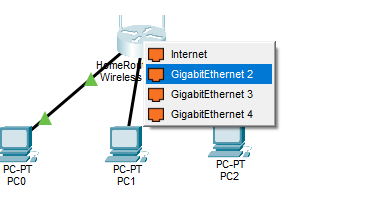
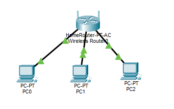
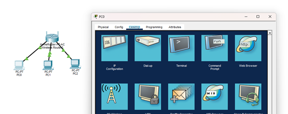
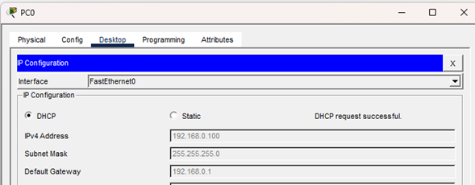
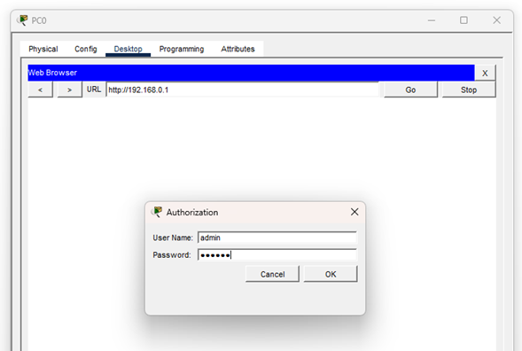
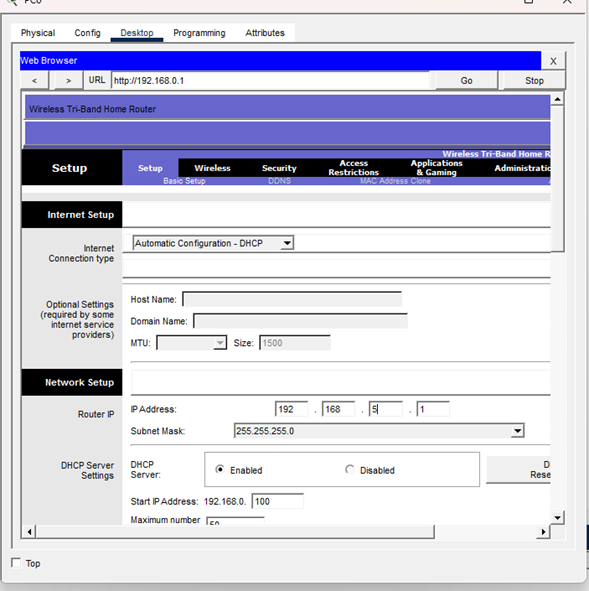
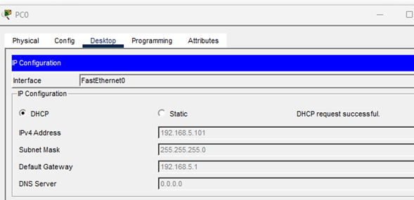
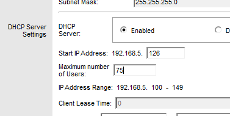
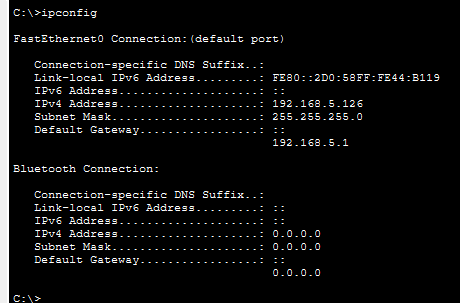

# Práctica de Laboratorio: Configuración de DHCP en un Enrutador Inalámbrico (Packet Tracer)

Este repositorio contiene la documentación paso a paso del laboratorio de redes enfocado en la implementación, configuración de rangos de red y administración de un servidor **DHCP** en un entorno doméstico simulado utilizando **Cisco Packet Tracer**.

---

## Objetivos del Laboratorio
* Conectar múltiples dispositivos finales (PCs) a un enrutador inalámbrico utilizando medios físicos adecuados.
* Modificar la dirección IP predeterminada de la red y el segmento de puerta de enlace (*Default Gateway*).
* Configurar un rango de direcciones IP específico para el servidor DHCP del enrutador.
* Automatizar la asignación de direcciones IP a los clientes mediante DHCP.
* Verificar la conectividad de la red local mediante la herramienta de diagnóstico `ping`.

---

## Topología y Configuración Inicial

### Parte 1: Conexión de Dispositivos
1. **Dispositivos de Red:** Se seleccionó e incorporó un enrutador inalámbrico (modelo *Home Router* / `WRT300N`) desde la categoría `[Network Devices] > [Wireless Devices]`.
2. **Dispositivos Finales:** Se agregaron tres computadoras genéricas (`PC0`, `PC1` y `PC2`) desde la categoría `[End Devices]`.
3. **Cableado Estructurado:** Se utilizó el medio físico de **Cable Directo** (*Copper Straight-Through*, identificado con la línea negra continua) para interconectar las terminales.
   * Se conectó el puerto `FastEthernet0` de cada PC a los puertos Ethernet disponibles (`Ethernet 1`, `Ethernet 2` y `Ethernet 3`) del enrutador.
   * *Nota técnica:* Se omitió intencionalmente el puerto **Internet (WAN)**, ya que este último está destinado a la conexión con módems externos y no pertenece a la red local de área local (LAN) que estamos configurando.
4. **Convergencia:** Se aguardó a que los indicadores de enlace físico de los cables pasaran de color ámbar a **verde fijo** (indicador de estado activo).

<table>
  <tr>
    <td align="center">
      <br>
    </td>
    <td align="center">
      <br>
    </td>
  </tr>
</table>

---

## Desarrollo del Laboratorio

### Parte 2: Análisis de la Configuración DHCP Predeterminada
1. En `PC0`, navegamos a la pestaña `Desktop > IP Configuration` y seleccionamos la opción **DHCP** para solicitar de manera automática los parámetros de red al enrutador.
2. El cliente recibió con éxito los parámetros de red (*DHCP request successful*).
   * **Dirección IP del Gateway Predeterminado:** `192.168.0.1`
3. Utilizando el navegador web (*Web Browser*) incorporado en `PC0`, se ingresó a la URL `http://192.168.0.1` para acceder a la interfaz de administración del enrutador.
4. Se autenticó utilizando las credenciales predeterminadas de fábrica (`Usuario: admin`, `Contraseña: admin`).

<table>
  <tr>
    <td align="center">
      <br>
    </td>
    <td align="center">
      <br>
    </td>
    <td align="center">
      <br>
    </td>
  </tr>
</table>

---

### Parte 3: Modificación del Segmento de Red (IP del Enrutador)
Para evitar conflictos con redes predeterminadas comunes y cumplir con los requerimientos del ejercicio:
1. En la pestaña `Setup > Basic Setup`, dentro de la sección *Network Setup (Router IP)*, se modificó la dirección IP del enrutador a **`192.168.5.1`**.
2. Nos desplazamos al final de la página y se hizo clic en **Save Settings**.
3. Debido al cambio de segmento, la página web arrojó un error de tiempo de espera (*Request Timeout*) ya que la PC aún se encontraba en la subred antigua (`192.168.0.x`).
4. Para solucionar la disociación, se actualizó la configuración de `PC0` alternando momentáneamente entre *Static* y nuevamente a **DHCP**, forzando al cliente a solicitar una nueva concesión de IP acorde a la nueva subred (`192.168.5.x`).

<table>
  <tr>
    <td align="center">
      <br>
    </td>
    <td align="center">
      <br>
    </td>
  </tr>
</table>

---

### Parte 4: Configuración del Rango del Servidor DHCP
Una vez restablecido el acceso web con la nueva IP `192.168.5.1`:
1. Se configuró el servidor DHCP interno del enrutador con un rango personalizado para la administración eficiente de las direcciones de los hosts.
2. Se modificó el valor de la dirección IP inicial del servidor (*Starting IP Address*) de `100` a **`126`** (quedando como `192.168.5.126`).
3. Se estableció el parámetro *Maximum Number of Users* en **`75`**.
4. Se guardaron los cambios (*Save Settings*) y se refrescó nuevamente la configuración IP de `PC0`].

Al verificar mediante la línea de comandos (`Command Prompt`) ejecutando el comando `ipconfig`, obtuvimos:
* **IPv4 Address (PC0):** `192.168.5.126`
* **Subnet Mask:** `255.255.255.0`
* **Default Gateway:** `192.168.5.1`

<table>
  <tr>
    <td align="center">
      <br>
    </td>
     <td align="center">
      <br>
    </td>
  </tr>
</table>
---

### Parte 5: Activación de DHCP en Clientes Restantes (`PC1` y `PC2`)
Se repitió el procedimiento de asignación automática en los equipos restantes para comprobar la distribución secuencial del pool DHCP:
* **`PC1`:** Al habilitar DHCP, obtuvo de manera automática la dirección **`192.168.5.127`**.
* **`PC2`:** Al habilitar DHCP, obtuvo de manera automática la dirección **`192.168.5.128`** (o consecutivo inmediato según la secuencia de peticiones).

---

### Parte 6: Verificación de Conectividad (Pruebas de Red)
Para comprobar que los equipos de la red local se comunican de forma transparente, se ingresó al símbolo del sistema (`Command Prompt`) de `PC2` y se ejecutaron pruebas de conectividad mediante el protocolo ICMP (`ping`):

1. **Prueba hacia el Enrutador (Gateway):**
   ```bash
   ping 192.168.5.1
