# Reporte de Análisis Forense: Incidente FTP
> **Práctica Guiada - Análisis de Tráfico de Red con Wireshark**

El presente documento detalla el análisis paso a paso de una captura de tráfico de red enfocado en el protocolo FTP. El objetivo de la práctica es comprender cómo un atacante puede explotar protocolos de transmisión en texto plano para realizar reconocimiento, ataques de fuerza bruta y exfiltración de datos.

## 1. Preparación y Conceptos Básicos (FTP)
El protocolo **FTP (File Transfer Protocol)** opera típicamente en el puerto 21 para el control de la conexión. Su principal vulnerabilidad radica en la falta de cifrado, transmitiendo credenciales y datos en texto plano. A pesar de los riesgos, sigue siendo utilizado en equipos industriales, cámaras IP antiguas y sistemas heredados (*legacy*) debido a los altos costos de migración.

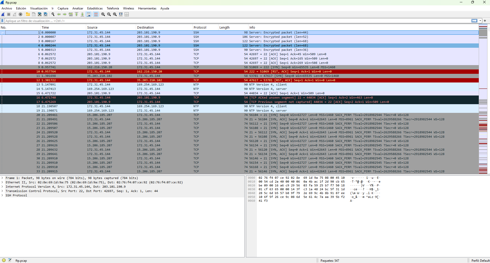

## 2. Inspección del Modelo OSI en Wireshark
Al seleccionar una trama en Wireshark, es posible desglosar la información según las capas del modelo OSI:
* **Capa Física / Enlace de Datos (Ethernet):** Permite visualizar las direcciones MAC de origen y destino.
* **Capa de Red (IPv4):** Muestra las direcciones IP de origen y destino involucradas en la comunicación.
* **Capa de Transporte (TCP):** Detalla los puertos lógicos utilizados para establecer la sesión.

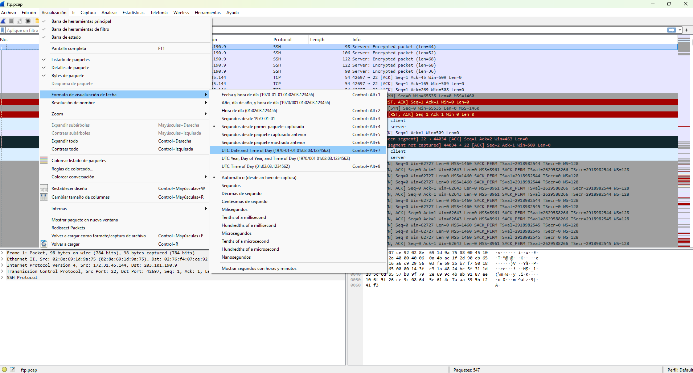
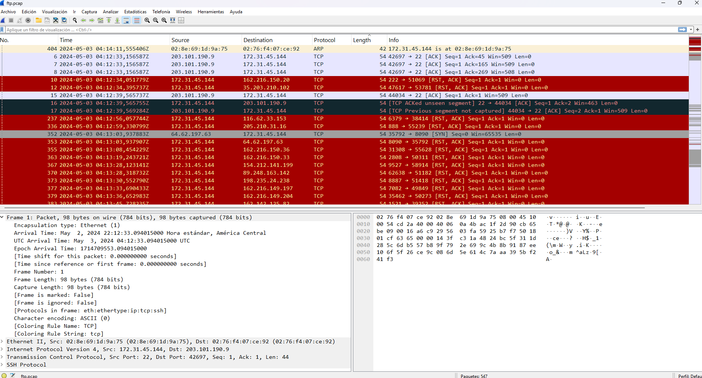

## 3. Filtrado de Tráfico y Reconocimiento (Banner Grabbing)
Aplicando el filtro `ftp`, limitamos la vista a los paquetes relevantes. En los primeros paquetes de respuesta del servidor se observa el código `220`, que expone la versión del servicio: `vsFTPd 3.0.5`.

Esta exposición de información es crítica, ya que un atacante puede utilizarla para buscar vulnerabilidades y *exploits* específicos para esa versión (fase de reconocimiento).

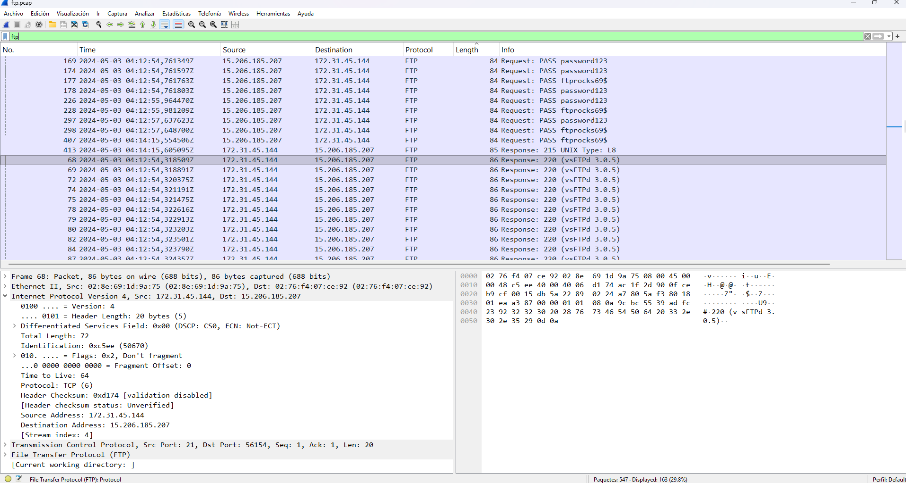
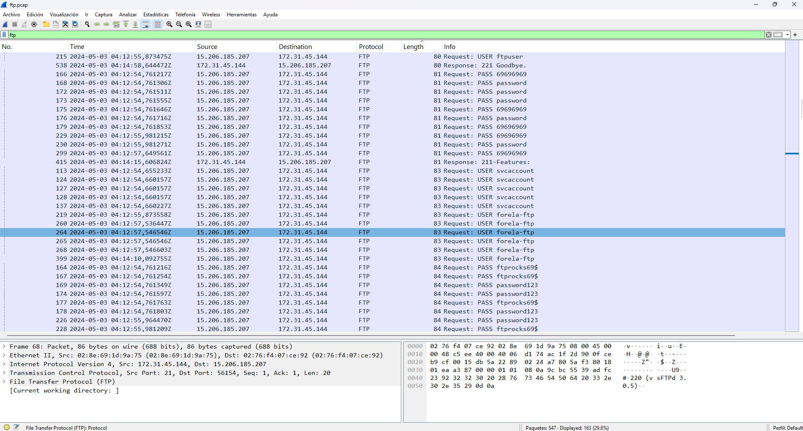

## 4. Análisis de Autenticación y Fuerza Bruta
Mediante la herramienta **Follow TCP Stream** (Seguir secuencia TCP), se reconstruyó la conversación completa entre el cliente y el servidor. Se evidenciaron múltiples intentos fallidos de inicio de sesión (código `530 Login Incorrect`), lo que sugiere un ataque de fuerza bruta o de diccionario.

Finalmente, se detectó una autenticación exitosa (código `230 Login successful`) utilizando las credenciales comprometidas:
* **Usuario:** `forela-ftp`
* **Contraseña:** `ftprocks595`

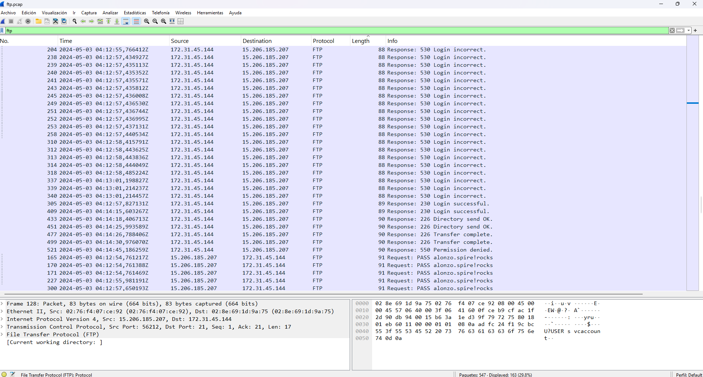
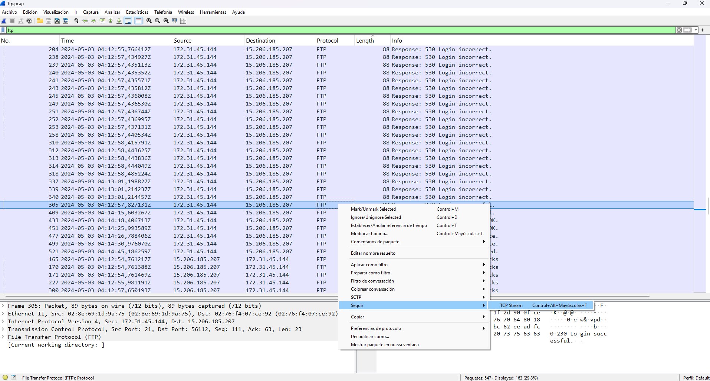

## 5. Post-Explotación y Exfiltración de Datos (FTP-DATA)
Tras obtener acceso, el atacante exploró los directorios y procedió a la exfiltración. Se utilizó la función **File > Export Objects > FTP-DATA** de Wireshark para recuperar los archivos transferidos durante el incidente. Además, se observó la creación de un archivo anómalo llamado `Hacked.txt`, un indicador de compromiso (IoC) clásico.

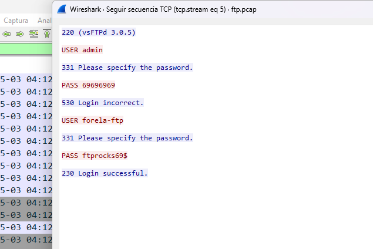
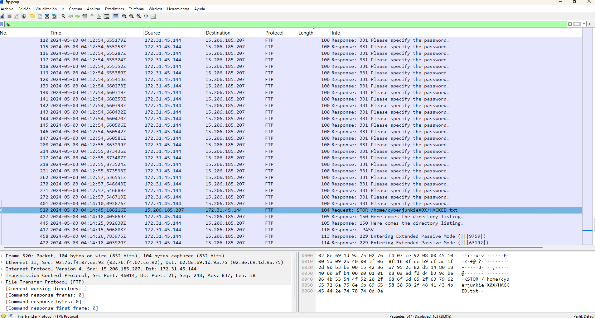
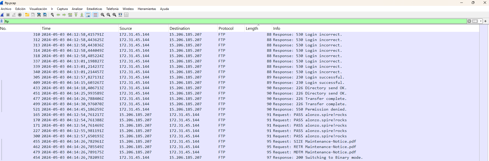

## 6. Análisis de la Información Comprometida
Los archivos exfiltrados resultaron contener información altamente sensible:
* `Maintenance-Notice.pdf`: Un documento corporativo que incluye credenciales de un servidor SSH ocultas y vectores para posibles ataques de *phishing*.
* `s3_buckets.txt`: Archivo que expone la infraestructura en la nube de la organización, proporcionando al atacante una nueva superficie de ataque.

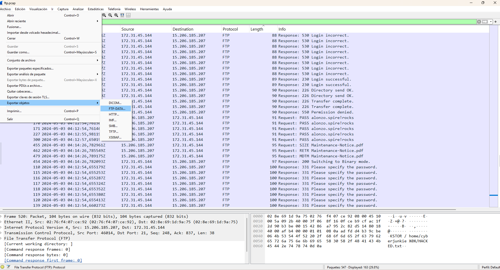
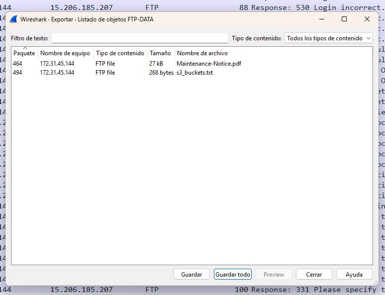
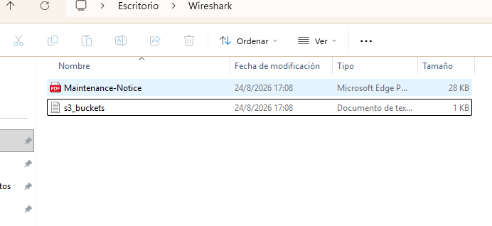
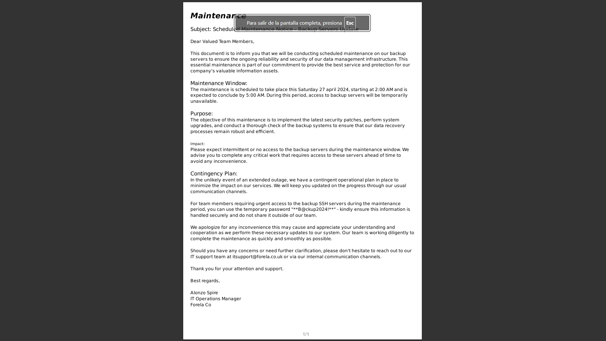
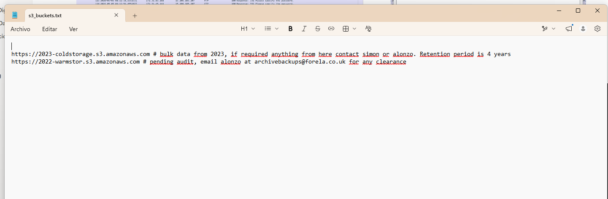

## 7. Resumen del Incidente y Conclusión
* **Vector de Entrada:** Servicio FTP expuesto sin cifrado.
* **Técnicas Utilizadas:** Reconocimiento (Banner Grabbing), Fuerza Bruta, Exfiltración de Datos.
* **Impacto:** Compromiso total de credenciales y fuga de información corporativa e infraestructura Cloud.
* **Recomendación de Mitigación:** Deshabilitar FTP y migrar los servicios a protocolos seguros como **SFTP** o **FTPS**. Implementar monitoreo de red para alertar sobre transferencias en texto plano y bloqueos automáticos ante repetidos intentos de inicio de sesión fallidos.
